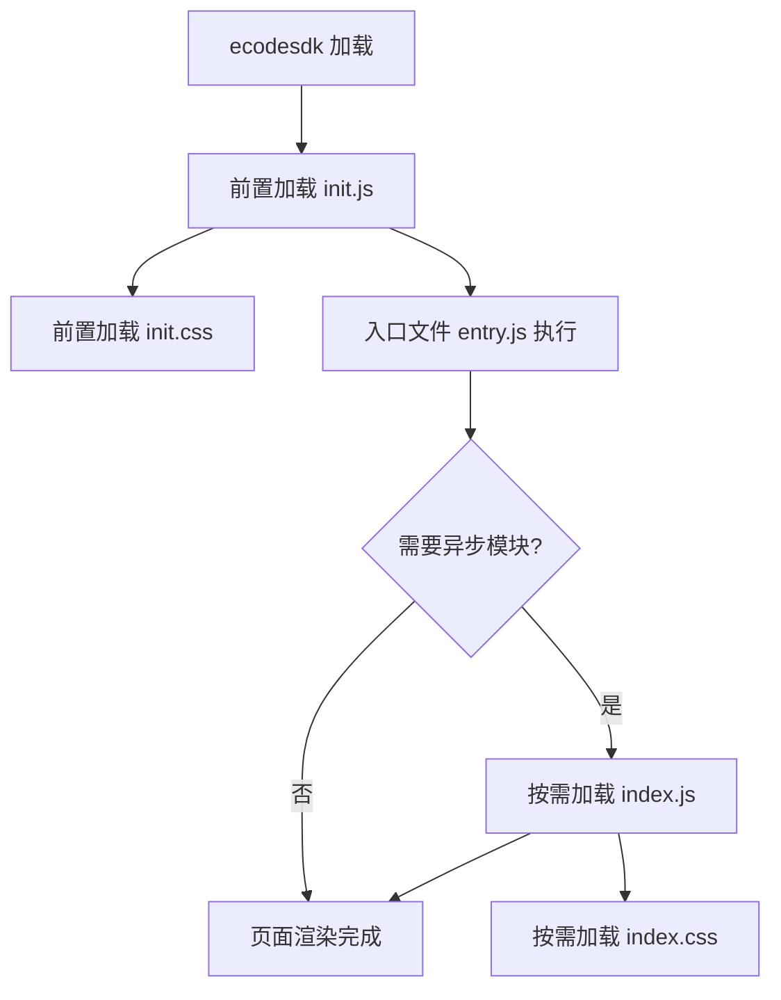

# 19 - 前端深入开发：模块系统

## 概述

ecode 以编辑器中创建的 `.js` 文件为单位提供模块化编译，支持标准的 ES6 `import`/`export` 语法，但由于运行时兼容性限制，动态导入需使用 ecode SDK 提供的 `asyncImport` 方法。

---

## 2.4.1 模块化

ecode 支持编译标准的 JavaScript modules，但有如下限制：

- 以编辑器中创建的 `.js` 文件为单位提供模块化编译，**不支持编译其他格式文件**
- 导出模块使用 `export` 语法
- 静态导入模块使用 `import` 语法
- **不支持标准的 `import()` 动态导入**，需使用 `@weapp/ecodesdk` 的 `asyncImport` 方法
- 只支持标准的 ES6 API 和 JSX 相关编译，不支持其他超前属性兼容

---

## 2.4.2 入口文件

- 新建项目默认自动创建一个**前置加载**的入口文件 `entry.js`，默认绑定文件名
- 如果手动创建文件，需要**手动设置为前置加载**
- 入口文件本身需要前置加载，但额外会进行一次**默认代码执行**
- **只有具有入口文件的项目在发布后才会执行和生效**
- 没有入口文件（或入口文件不前置加载）的项目，发布后前置加载和异步加载模块可被其他项目引用，但**项目本身不会执行**
- **入口文件不能被其他文件引用**，否则可能因找不到模块导致报错

---

## 2.4.3 前置加载

通过右键菜单将文件设置为"前置加载"：

- 前置加载的 `.js` 文件会被编译进 `/ecodestatic/dev/init.js`，在 ecodesdk 加载之后立即加载
- 前置加载的文件可以导出模块，可被其他前置加载文件、异步加载文件、入口文件导入使用
- 前置加载的 `.css` 文件会被合并到 `/ecodestatic/dev/init.css`

**使用建议**：入口文件、全局注册（regOvProps/regOvComponent）放在前置加载文件中；业务组件放在异步加载文件中。

---

## 2.4.4 异步加载

不设置前置加载的 `.js` 文件会被编译进当前应用的按需异步加载文件：

- JS: `/ecodestatic/release/${appId}/index.js`
- CSS: `/ecodestatic/release/${appId}/index.css`

在其他文件中使用 `asyncImport` 加载对应模块时才按需加载：

```js
import { asyncImport } from '@weapp/ecodesdk';
asyncImport('${appId}', 'component/index').then(esmodule => {
    console.log(esmodule);
});
```

**重要**：`@weapp/ui` 组件库仅支持在异步非前置文件中使用，不要在前置加载文件中直接使用组件库。

---

## 2.4.5 模块导入导出

### 注意事项

1. **不要引用入口文件**，可能导致找不到模块报错
2. **不要产生文件间的循环引用**，部分模块将无法被处理导致报错
3. **不支持在 js 文件中引用其他类型文件**

### 同应用内：前置文件导入前置文件

```js
// 同一个应用中 前置文件(模块) 导入 前置文件(模块)
import defaultExport, * as fileExportsJs from "./exports";
import { a, b } from "./exports";
import { c, d as importD } from "./exports";
```

### 同应用内：非前置文件导入其他文件

```js
// 同一个应用中 非前置文件(模块) 导入 其他文件(模块)
import Todo from './Todo';
import { a, b } from "../exports";
```

### 异步导入非前置文件（同应用/跨应用）

```js
import { asyncImport } from '@weapp/ecodesdk';

// 同应用：导入非前置文件模块
asyncImport('${appId}', 'component/index').then(esmodule => {
    console.log('component/index: ', esmodule);
});

// 跨应用：将 ${appId} 更换为指定的应用 appId
asyncImport('652535876106272768', 'Main.js').then(esmodule => {
    console.log('跨应用模块: ', esmodule);
});
```

### 异步导入 React 组件

```js
import { asyncImport } from '@weapp/ecodesdk';

// 导入默认导出组件
const Todo = React.lazy(() => asyncImport('${appId}', 'component/index'));

// 导入命名导出组件
const Item = React.lazy(() => asyncImport('${appId}', 'component/Todo').then(esmodule => ({
  default: esmodule.Item
})));

// 跨应用导入组件
const App2Main = React.lazy(() => asyncImport('652535876106272768', 'Main.js'));
```

### 跨应用导入前置文件

```js
import { jsonp } from '@weapp/ecodesdk';

// 跨应用导入另一个应用的前置文件(模块)
const { pre } = jsonp.require('652535876106272768', 'pre.js');
```

### 自定义组件应用模块导入

```js
// 导入自定义组件应用中的非前置文件模块
const Todo = React.lazy(() => asyncCustAppImport('coms', '${appId}', 'component/index'));

const Item = React.lazy(() => asyncCustAppImport('coms', '${appId}', 'component/Todo').then(esmodule => ({
  default: esmodule.Item
})));

const App2Main = React.lazy(() => asyncCustAppImport('coms', '652535876106272768', 'Main.js'));
```

### 导入方式总结

| 场景 | 方法 | 说明 |
|------|------|------|
| 同应用前置→前置 | `import` | 标准 ES6 静态导入 |
| 同应用非前置→非前置 | `import` | 标准 ES6 静态导入 |
| 导入非前置模块 | `asyncImport(appId, path)` | 异步按需加载，返回 Promise |
| 导入 React 组件 | `React.lazy(() => asyncImport(...))` | 配合 Suspense 使用 |
| 跨应用导入前置模块 | `jsonp.require(appId, file)` | 同步获取前置模块导出 |
| 自定义组件应用导入 | `asyncCustAppImport('coms', appId, path)` | 自定义组件类型应用 |

---

## 2.4.6 开发依赖

### 内置依赖列表

| 依赖 | 版本 | 说明 | 引入方式 |
|------|------|------|---------|
| `react` | 17 | 构建用户界面的 JavaScript 库 | `import React from 'react'` |
| `react-dom` | 17 | DOM 渲染 | `import ReactDOM from 'react-dom'` |
| `axios` | 0.21 | 基于 Promise 的 HTTP 库 | `import axios from 'axios'` |
| `mobx` | 4 | 简单可扩展的状态管理 | `import * as mobx from 'mobx'` |
| `mobx-react` | 6 | React 中使用 mobx 的工具库 | `import { observer } from "mobx-react"` |
| `mobx-react-lite` | 6 | Hooks 轻量版 | `import { observer } from "mobx-react-lite"` |
| `react-router-dom` | 5 | 声明式路由 | `import { Route, withRouter, Link } from "react-router-dom"` |
| `loadjs` | 4 | 小型异步加载器 | `import loadjs from 'loadjs'` |
| `@weapp/utils` | - | E10 公共工具库 | `import { regOvProps } from '@weapp/utils'` |
| `@weapp/ecodesdk` | - | ecode 工具库 | `import { asyncImport } from '@weapp/ecodesdk'` |
| `@weapp/ui` | - | E10 公共组件库 | `import { Button } from '@weapp/ui'` |

### 关键限制

- `@weapp/ui` 组件库**仅支持在异步非前置文件中使用**，加载晚于 ecode
- `mobx` 和 `mobx-react` 可用于全局状态管理
- `axios` 可直接使用，也可使用 `@weapp/utils` 提供的 `request` 方法（推荐）

---

## 2.4.7 加载第三方资源

**注意：一般不建议自行引入其他三方资源**，标准依赖已经十分完善，请尽量在标准支持范围内完成需求，以控制加载体积和性能。

可通过 `loadjs` 引入生产文件方式使用，资源放到应用的 `resources` 目录下：

```js
import loadjs from 'loadjs';

// 选中 resources/vue.js 右键，可以复制资源地址
// 严禁使用外部在线资源，包括 CDN 地址！
loadjs('${appRes}/vue.js', {
    success: () => {
        // do something
    }
});
```

**安全规范**：严禁直接加载外部在线资源（包括 CDN 地址），请下载在线资源到本地并上传到 `resources` 目录下引用。

---

## 2.4.8 模板变量

模板变量用于应用内全局变量声明（目前仅 ecode 中创建的应用支持，页面表单代码块尚未支持）。在应用迁入迁出过程中，相关声明的变量会根据关联自动替换。

### 内置模板变量

| 变量 | 说明 |
|------|------|
| `${appId}` | 当前应用的 AppId |
| `${appRes}` | 当前应用的 resources 目录地址 |

### 创建自定义模板变量

在项目设置中创建模板变量（key-value 形式），创建后可在代码中通过 `${变量名}` 使用。

### 使用方式

```js
// 路由中使用
<Route path={`/sp/custom/${'${appId}'}/todo`}>

// CSS 中使用（支持基线：10.0.2408.01）
.app-${'${appId}'}-newButton {
  position: relative;
}

// resources 路径
loadjs('${'${appRes}'}/vue.js', { ... });
```

### className 注意事项

- className **不能使用 weId 做样式限定**
- className 中使用 appId 变量：`.app-${appId}-xxx`，支持基线版本 **10.0.2408.01**

---

## 加载流程图



## 关键规则速查

| 规则 | 说明 |
|------|------|
| 入口文件必须前置加载 | 否则项目不会执行 |
| 入口文件不可被引用 | 引用会导致报错 |
| 禁止循环引用 | 部分模块将无法处理 |
| 前置文件可用 import | 标准 ES6 静态导入 |
| 非前置文件用 asyncImport | 不支持 import() 动态导入 |
| @weapp/ui 仅在异步文件中使用 | 前置文件中使用会找不到组件 |
| CSS 中 appId 变量需基线 ≥ 2408 | `${appId}` 模板变量支持 |
| 禁止外部 CDN 资源 | 下载到 resources 目录本地引用 |
